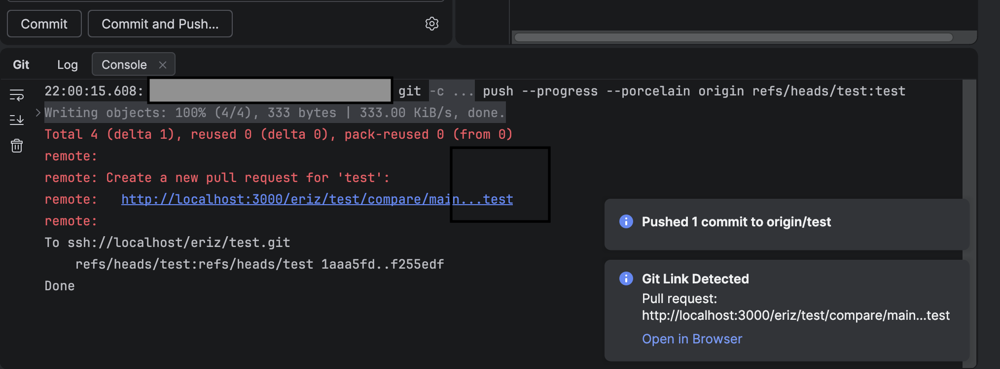
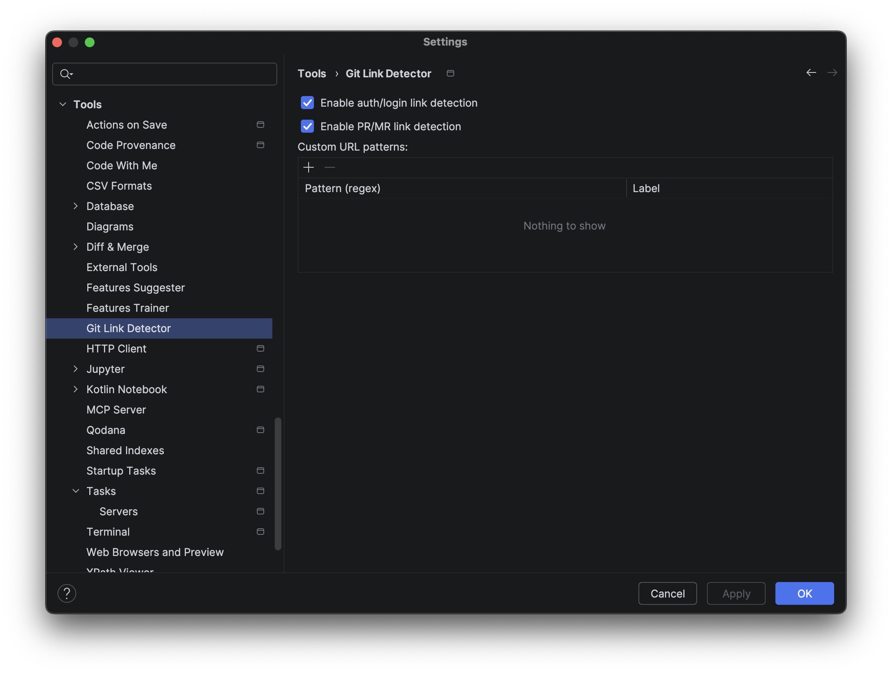

# Git Link Detector

This is a simple plugin that shows a popup if git remote returns some link with pull request or SSO login URL.

PS. Vibe coded as it became a little bit frustrating to break the workflow every time I start work.